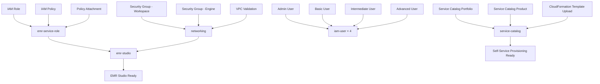

# Amazon EMR Studio IAM Configuration

This Terraform module sets up the necessary resources for AWS Service Catalog integration to the EMR Studio module, enabling self-service EMR cluster provisioning through pre-approved CloudFormation templates.

## Overview

### What is Amazon EMR Studio?

Amazon EMR Studio is a web-based integrated development environment (IDE) for fully managed Jupyter notebooks that run on Amazon EMR clusters.

- **Cost**: EMR Studio creation is free. You only pay for Amazon S3 storage and EMR clusters when using the studio
- **Team Resource**: Designed to be shared among team members with different access levels
- **Managed Service**: Fully managed Jupyter notebook environment

### Key Features

- **On-demand Cluster Access**: Launch and access EMR clusters to run Jupyter notebook jobs
- **Notebook Management**: Explore, create, and save notebooks with version control
- **Real-time Collaboration**: Work collaboratively with other users in the same workspace
- **Workflow Integration**: Run parameterized notebooks with orchestration tools like Apache Airflow or AWS MWAA
- **Git Integration**: Link code repositories such as GitHub for version control

### AWS Services Integration

- **Amazon EMR**: Connects to clusters in specified subnets
- **Amazon S3**: Stores notebook files and outputs
- **AWS IAM**: Manages user access and service permissions
- **AWS Secrets Manager**: Secures Git repository credentials
- **VPC Security Groups**: Establishes secure network channels between Studio and clusters

## Terraform Module Structure

This module creates:

1. **EMR Studio Service Role**: Allows EMR Studio to interact with AWS services
2. **IAM Users with Different Access Levels**:
   - **Admin**: Full EMR Studio administration permissions
   - **Basic**: Read-only and basic notebook operations
   - **Intermediate**: Cluster creation using templates
   - **Advanced**: Full cluster creation and configuration permissions
3. **Networking Infrastructure**: Security groups and VPC validation for EMR Studio connectivity
4. **EMR Studio Instance**: The main studio resource with IAM authentication
5. **Service Catalog Integration**: Portfolio and products for self-service EMR cluster provisioning

### Module Architecture

```
emr-mgmt/emr-studio/
├── main.tf                    # Root module configuration
├── variables.tf               # Input variables
├── README.md                  # This documentation
├── modules/
│   ├── emr-service-role/      # EMR Studio service role
│   │   ├── main.tf
│   │   ├── variables.tf
│   │   └── outputs.tf
│   ├── iam-user/              # Reusable IAM user module
│   │   ├── main.tf
│   │   ├── variables.tf
│   │   └── outputs.tf
│   ├── networking/            # Security groups and VPC validation
│   │   ├── main.tf
│   │   ├── variables.tf
│   │   └── outputs.tf
│   ├── emr-studio/            # EMR Studio resource
│   │   ├── main.tf
│   │   ├── variables.tf
│   │   └── outputs.tf
│   └── service-catalog/       # Service Catalog for self-service provisioning
│       ├── main.tf
│       ├── variables.tf
│       └── outputs.tf
├── cloud-formation-templates/ # CloudFormation templates for Service Catalog
│   └── example-two-node-cluster.yaml
└── policies/                  # JSON policy files
    ├── service_role_trust_policy.json
    ├── service_role_permissions.json
    ├── admin_user_permissions.json
    ├── basic_level_user_permissions.json
    ├── intermediate_level_user_permissions.json
    └── advanced_level_user_permissions.json
```

### Module Dependencies

The modules have the following dependency relationships:

1. **emr-service-role** → Independent (creates IAM role and policy)
2. **iam-user** → Independent (creates users for each access level)
3. **networking** → Independent (validates VPC and creates security groups)
4. **emr-studio** → Depends on: emr-service-role, networking
5. **service-catalog** → Independent (creates portfolio, products, and uploads CloudFormation templates)

### Resource Creation Flow



### Reusable Components

**iam-user Module**: 
- Used 4 times with different `user_level` parameters
- Dynamically selects appropriate policy file based on user level
- Applies conditional variables for intermediate/advanced users

**Policy Template System**:
- JSON policy files with variable substitution
- Templatefile function for dynamic policy generation
- Consistent parameter naming across all policies

### Resource Naming Convention

All resources follow a consistent naming pattern:

- **IAM Resources**: `emr-mgmt-emr-studio-{component}-{identifier}`
- **Security Groups**: `{studio_name}-{purpose}-sg`
- **EMR Studio**: `{studio_name}` (configurable)

### Tagging Strategy

**Standard Tags Applied to All Resources**:
- `Name`: Resource-specific identifier
- `Project`: "aws-and-chill"

**Flexible Tagging**:
- EMR Studio module accepts additional tags via `tags` variable
- Tags are merged with standard tags using Terraform's `merge()` function

## Prerequisites

- AWS CLI configured with appropriate permissions
- Terraform >= 0.12
- An existing S3 bucket for EMR Studio notebooks
- VPC and subnets where EMR clusters will be deployed

## Usage

### 1. Configure Variables

Create a `terraform.tfvars` file with your specific values:

```hcl
aws_region                            = "us-west-2"
emr_studio_service_role              = "EMRStudio-Service-Role"
emr_studio_bucket                    = "your-emr-studio-bucket-name"
virtual_cluster_id                   = "*"  # or specific cluster ID
emr_on_eks_execution_role            = "*"  # or specific role name
s3_location_emr_studio_notebooks     = "s3://your-emr-studio-bucket/notebooks/"
s3_location_cloud_formation_templates = "s3://your-bucket-name/cloud-formation-templates/"
vpc_id                               = "vpc-12345678"
subnet_ids                           = ["subnet-12345678", "subnet-87654321"]
```

### 2. Deploy Infrastructure

```bash
cd emr-mgmt/emr-studio

terraform init
terraform plan
terraform apply
```

### 3. Verify Deployment

```bash
terraform output
```

## IAM Policies and Permissions

### EMR Studio Service Role

**Purpose**: Enables EMR Studio to interact with other AWS services securely.

**Key Permissions**:
- Establish secure network channels between workspaces and clusters
- Store notebook files in Amazon S3
- Access AWS Secrets Manager for Git repository integration
- Manage EMR cluster lifecycle operations

**Files**:
- `policies/service_role_trust_policy.json`: Trust relationship with security conditions
- `policies/service_role_permissions.json`: Service-specific permissions

### User Access Levels

#### Basic User
- **Use Case**: Data analysts who need to run existing notebooks
- **Permissions**: View and execute notebooks, connect to existing clusters
- **Restrictions**: Cannot create new EMR clusters
- **Policy File**: `policies/basic_level_user_permissions.json`

#### Intermediate User
- **Use Case**: Data scientists who need to create clusters from templates
- **Permissions**: All basic permissions plus cluster creation using predefined templates
- **Restrictions**: Limited to cluster templates only
- **Policy File**: `policies/intermediate_level_user_permissions.json`

#### Advanced User
- **Use Case**: Data engineers and ML engineers who need full cluster control
- **Permissions**: All intermediate permissions plus custom cluster configuration
- **Additional Access**: Full EMR cluster management and custom configurations
- **Policy File**: `policies/advanced_level_user_permissions.json`
- **Note**: Optimized to stay within AWS IAM policy size limits (6,144 characters) by removing duplications and combining similar statements

#### Admin User
- **Use Case**: EMR Studio administrators
- **Permissions**: Full EMR Studio management including user management and studio configuration
- **Policy File**: `policies/admin_user_permissions.json`

## Networking

### VPC and Security Group Configuration

The networking module creates the required security groups and validates the VPC configuration for EMR Studio connectivity.

#### Security Groups

**EMR Studio Workspace Security Group**:
- **Purpose**: Controls access to the EMR Studio workspace interface
- **Ingress Rules**:
  - Port 443 (HTTPS): Access to EMR Studio UI from anywhere (0.0.0.0/0)
- **Egress Rules**: All outbound traffic allowed
- **Resource Name**: `${emr_studio_name}-workspace-sg`

**EMR Studio Engine Security Group**:
- **Purpose**: Enables communication between EMR Studio and EMR clusters
- **Ingress Rules**:
  - Port 18888: Jupyter notebook communication from workspace security group
  - Port 8998: Livy server communication from workspace security group  
  - Port 18080: Spark History Server access from workspace security group
  - Ports 0-65535: Internal communication within the same security group
- **Egress Rules**: All outbound traffic allowed
- **Resource Name**: `${emr_studio_name}-engine-sg`

#### Network Requirements

**VPC Configuration**:
- Must have existing VPC with valid ID
- Subnets must be in the same VPC
- At least one subnet required (validated)
- Subnets should have internet access for EMR Studio functionality

**Data Sources**:
- `aws_vpc.selected`: Validates the specified VPC exists
- `aws_subnets.selected`: Validates subnets exist and belong to the VPC

### Network Architecture

```
Internet Gateway
       |
   VPC (existing)
       |
   Subnets (existing)
       |
+------------------+     +-------------------+
| Workspace SG     |     | Engine SG         |
| Port 443 (HTTPS) | --> | Ports 18888,8998, |
| From: 0.0.0.0/0  |     | 18080 + Internal  |
+------------------+     +-------------------+
       |                         |
   EMR Studio              EMR Clusters
   Workspace              (Future deployment)
```

## Create EMR Studio

### EMR Studio Resource Configuration

The EMR Studio module creates the main studio resource with the following configuration:

#### Core Configuration

**Authentication Mode**: 
- Set to "IAM" for identity-based access control
- Users authenticate using AWS IAM credentials

**Network Settings**:
- **VPC**: Uses the VPC ID from the networking module
- **Subnets**: Uses subnet IDs validated by the networking module
- **Security Groups**: 
  - Workspace Security Group: Controls Studio UI access
  - Engine Security Group: Manages cluster communication

**Service Integration**:
- **Service Role**: ARN from the EMR Studio service role module
- **S3 Location**: Default location for storing notebooks and outputs

#### Dependencies

The EMR Studio resource depends on:
1. **EMR Studio Service Role**: Must be created first to provide necessary permissions
2. **Networking Module**: Security groups and VPC validation must complete first


#### Studio Properties

**Studio Name**: Configurable via `emr_studio_name` variable (default: "aws-and-chill-emr-studio")

**Tags Applied**:
- `Name`: Studio name for identification
- `Project`: "aws-and-chill" for resource grouping
- Additional tags can be merged via the `tags` variable


## Security Best Practices

1. **Principle of Least Privilege**: Each user type has only the minimum permissions required
2. **Confused Deputy Protection**: Service role includes `aws:SourceArn` and `aws:SourceAccount` conditions
3. **Resource-Based Access**: Policies are scoped to specific resources and accounts
4. **Regular Review**: Periodically review and update permissions as requirements change

## Outputs

The module provides the following outputs:

- **EMR Studio Service Role**: Name, ARN, and policy ARN
- **IAM Users**: Details for all created users (admin, basic, intermediate, advanced)

## Tags Applied:
- `Name`: Studio name for identification
- `Project`: "aws-and-chill" for resource grouping
- Additional tags can be merged via the `tags` variable

## Service Catalog Integration

### Overview

The Service Catalog module provides self-service EMR cluster provisioning capabilities, allowing users to deploy pre-configured EMR clusters using approved CloudFormation templates.

### Components

#### Service Catalog Portfolio
- **Name**: "EMR Cluster Templates" (configurable)
- **Purpose**: Groups related EMR cluster products for organized access
- **Provider**: "AWS and Chill Project"

#### Service Catalog Product
- **Name**: "EMR Two Node Cluster" (configurable)
- **Type**: CloudFormation Template
- **Template**: Two-node EMR cluster with Spark, Livy, JupyterEnterpriseGateway, and Hive

#### CloudFormation Template

**Location**: `cloud-formation-templates/example-two-node-cluster.yaml`

**Template Features**:
- **EMR Release**: Configurable (default: emr-6.2.0)
- **Instance Type**: Configurable (default: m5.xlarge)
- **Applications**: Spark, Livy, JupyterEnterpriseGateway, Hive
- **Cluster Configuration**: 1 master + 1 core node
- **Logging**: Automatic S3 logging to `s3://aws-logs-{account-id}-{region}/elasticmapreduce/`

**Parameters**:
- `ClusterName`: Name for the EMR cluster
- `EmrRelease`: EMR version (emr-6.2.0 or emr-5.32.0)
- `ClusterInstanceType`: EC2 instance type (m5.xlarge or m5.2xlarge)
- `SubnetId`: VPC subnet for cluster deployment

### Self-Service Workflow

1. **User Access**: Users with intermediate/advanced permissions can access Service Catalog
2. **Product Selection**: Choose "EMR Two Node Cluster" from the "EMR Cluster Templates" portfolio
3. **Parameter Configuration**: Specify cluster name, EMR version, instance type, and subnet
4. **Provisioning**: Service Catalog deploys the EMR cluster using the CloudFormation template
5. **Management**: Users can manage the provisioned cluster through EMR Studio

### Template Storage

CloudFormation templates are automatically uploaded to S3 at the location specified by `s3_location_cloud_formation_templates` variable:
- **Bucket**: Extracted from the S3 URL
- **Key**: Combines the specified path with the template filename
- **Template URL**: Generated automatically for Service Catalog product

## References

- [Amazon EMR Studio Management Guide](https://docs.aws.amazon.com/emr/latest/ManagementGuide/emr-studio-configure.html)
- [EMR Studio Admin Permissions](https://docs.aws.amazon.com/emr/latest/ManagementGuide/emr-studio-admin-permissions.html#emr-studio-admin-permissions-table)
- [EMR Studio User Permissions](https://docs.aws.amazon.com/emr/latest/ManagementGuide/emr-studio-user-permissions.html)
- [AWS Service Catalog User Guide](https://docs.aws.amazon.com/servicecatalog/latest/userguide/what-is_concepts.html)

## Troubleshooting

### Common Issues
1. **Missing S3 Bucket**: Ensure the specified S3 bucket exists before deployment
3. **VPC Configuration**: Verify that subnets and security groups are properly configured for EMR clusters
